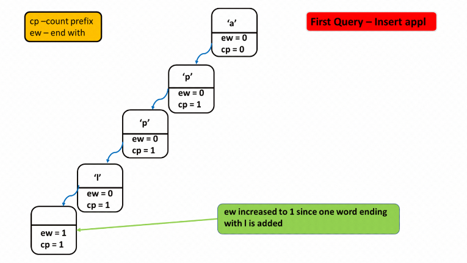
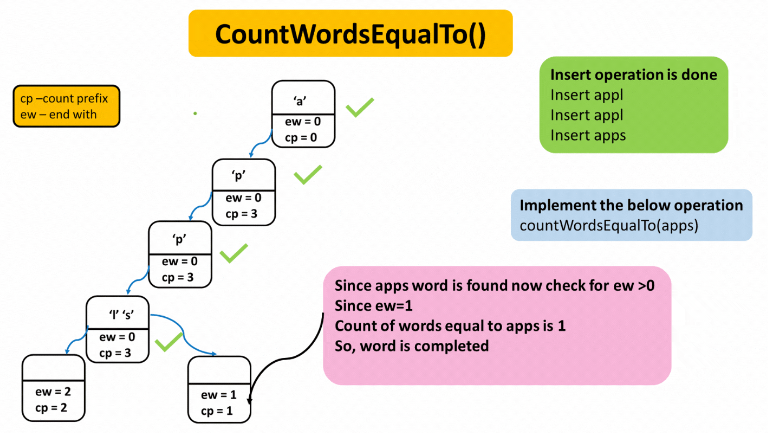
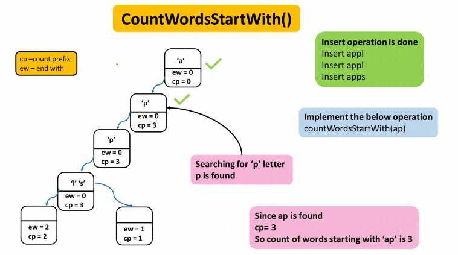
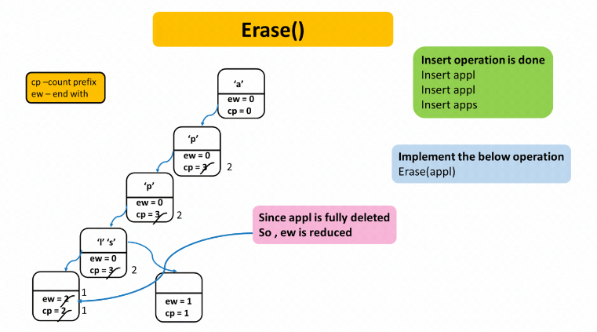

### Question
- You have to implement a data structure "TRIE" from scratch. Complete these functions:
  1) Trie(): Ninja has to initialize the object of this "TRIE" data structure.
  2) insert ("WORD"): Ninja has to insert the string "WORD" into this "TRIE” data structure.
  3) countWords EqualTo("WORD"): Ninja has to return how many times this "WORD" is present in this "TRIE".
  4) countWords StartingWith("PREFIX"): Ninjas have to return how many words are there in this "TRIE" that have the string "PREFIX” as a prefix.
  5) erase ("WORD"): Ninja has to delete one occurrence of the string "WORD" from the "TRIE".

### Sample Input
    ["Trie", "insert", "search", "search", "startsWith", "insert", "search"]
    [[], ["apple"], ["apple"], ["app"], ["app"], ["app"], ["app"]]

### Sample Output
    [null, null, true, false, true, null, true]

### Solution
- We will have a trie ds, which contains an array whose element will point to a reference, & two variables ew(endsWith) & cp(countPrefix)
- Insert -> Here we will maintain ew -> end with  and  cp -> count prefix,
  We will insert letter by letter by creating a new track every time. Starting from the root, fill letters of the word one by one and subsequently increase cp. At the end of every word, increase ew which denotes that word finished here. At the time a different prefix is found, we will create a new track by increasing cp.

- countwordsEqualTo() – This function will count complete words which are present in the Trie. Starting from the root, we will check for the given letter of the word to be found, if we find that cp >0 every time and at the end if (ew>0) this means word ends here means the complete word is present here.

- countWordsStartWith() – This function will count words starting with given string. Similarly, here also we begin from the root and check for the given letter one by one and check for cp>0. If it is, this means the given words are present here.

- Erase()- It will delete the string given from the Trie. In Erase() function, it is assumed that the given letter to be erased is present in the trie. Starting from the root, cp for the given prefix element is greater than 0, reduce cp by 1 and move on to a new track, and at last, reduce ew by 1  to mark that. word is fully deleted.

### Code
    static class Node {
        Node[] links = new Node[26];
        int cntEndsWith = 0;
        int cntPrefix = 0;

        public Node(){}

        boolean containsKey(char ch){
            return (links[ch-'a']!=null);
        }
        Node get(char ch){
            return links[ch-'a'];
        }
        void put(char ch, Node node){
            links[ch-'a'] = node;
        }
        void increaseEnd(){
            cntEndsWith++;
        }
        void increasePrefix() {
            cntPrefix++;
        }
        void deleteEnd() {
            cntEndsWith--;
        }
        void reducePrefix() {
            cntPrefix--;
        }
        int getEnd() {
            return cntEndsWith;
        }
        int getPrefix() {
            return cntPrefix;
        }
    }

    private static Node root;
    public Trie() {
        root = new Node();
    }

    public void insert(String word) {
        Node node = root;
        for (int i = 0; i < word.length(); i++) {
            if (!node.containsKey(word.charAt(i))){
                node.put(word.charAt(i), new Node());
            }
            node = node.get(word.charAt(i));
            node.increasePrefix();
        }
        node.increaseEnd();
    }

    public int countWordsEqualTo(String word) {
        Node node = root;
        for (int i = 0; i < word.length(); i++) {
            if (node.containsKey(word.charAt(i))){
                node = node.get(word.charAt(i));
            }else{
                return 0;
            }
        }
        return node.getEnd();
    }

    public int countWordsStartingWith(String word) {
        Node node= root;
        for (int i = 0; i < word.length(); i++) {
            if (node.containsKey(word.charAt(i))){
                node = node.get(word.charAt(i));
            }else{
                return 0;
            }
        }
        return node.getPrefix();
    }

    public void erase(String word) {
        Node node = root;
        for (int i = 0; i < word.length(); i++) {
            if (node.containsKey(word.charAt(i))){
                node = node.get(word.charAt(i));
                node.reducePrefix();
            }else{
                return;
            }
        }
        node.deleteEnd();
    }

### Complexity
1. Time Complexity - O(len)
2. Space Complexity - Hard to predict for Tries