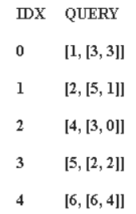
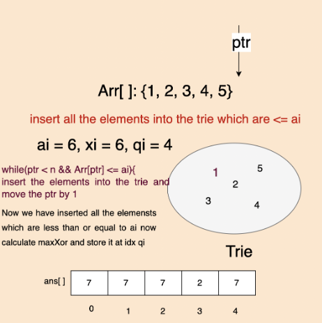

### Question
- You are given an array nums consisting of non-negative integers. You are also given a queries array, where queries[i] = [xi, mi]. 
- The answer to the ith query is the maximum bitwise XOR value of xi and any element of nums that does not exceed mi. In other words, the answer is max(nums[j] XOR xi) for all j such that nums[j] <= mi. If all elements in nums are larger than mi, then the answer is -1. 
- Return an integer array answer where answer.length == queries.length and answer[i] is the answer to the ith query.

### Sample Input
    nums = [0,1,2,3,4], queries = [[3,1],[1,3],[5,6]]
    nums = [5,2,4,6,6,3], queries = [[12,4],[8,1],[6,3]]

### Sample Output
    [3,3,7]
    [15,-1,5]

### Solution
- We already know how to get maxXOR value for an element X and array. Here, unlike the previous question, he array/list (arr) should contain only the elements which are less than or equal to mi. Our Trie & Node classes will remain exactly same
- We will initially sort the given 'nums' array
- Next we will use an array of Offline Queries, in which we will store, mi, xi, index and then sort it according to mi.

- We will also initialise an 'ans' array to store our answers
- Now we will run a loop for each of the given queries
  - While we are not going out of bound in the 'nums' array & nums[i] is < offlineQueris[i][0], i.e., mi of the first query, then we can just insert nums[i] in our trie (binary bits insertion)
  - Remember, we have the index stored in offlineQueries[i][2], so we can simply store the maximum, using getMax(offlineQueries[i][1]) in ans[offlineQueries[i][2]]
  - If, we have not inserted anything in our trie, then our ind=0, so store -1 in that case

### Code
    static class Node{
        Node[] links= new Node[2];  //for 0 or 1
        Node(){}
        boolean containsKey(int n){
            return links[n]!=null;
        }
        void put(int n, Node node){
            links[n]=node;
        }
        Node get(int n){
            return links[n];
        }
    }

    static class Trie{
        Node root;
        Trie(){
            root=new Node();
        }
        void insert(int n){
            Node node= root;
            for (int i = 31; i >=0 ; i--) {
                int bit = (n>>i) & 1;   //checking if ith bit is set or not
                if (!node.containsKey(bit)){
                    node.put(bit, new Node());
                }
                node = node.get(bit);
            }
        }

        int getMax(int n){
            Node node = root;
            int res=0;
            for (int i = 31; i >=0 ; i--) {
                int bit = (n >> i) & 1;
                if (node.containsKey(1-bit)){   //if we have opposite of the bit in our node
                    res = res | (1 << i);           // add it to our ans by doing OR
                    node = node.get(1 - bit);
                }else{
                    node = node.get(bit);
                }
            }
            return res;
        }
    }

    public int[] maximizeXor(int[] nums, int[][] queries) {
        Arrays.sort(nums);
        int[][] offlineQueries = new int[queries.length][3];
        int[] ans= new int[queries.length];
        for (int i=0; i< queries.length; i++){
            offlineQueries[i][0]= queries[i][1];
            offlineQueries[i][1]= queries[i][0];
            offlineQueries[i][2]=i;
        }

        Arrays.sort(offlineQueries,(o1,o2)-> o1[0]-o2[0]);
        int ind=0;
        Trie t= new Trie();
        Arrays.fill(ans, -1);

        for (int i = 0; i < queries.length; i++) {
            while (ind < nums.length && nums[ind] <= offlineQueries[i][0]){
                t.insert(nums[ind]);
                ind++;
            }

            int queryInd = offlineQueries[i][2];
            if (ind!=0) ans[queryInd] = t.getMax(offlineQueries[i][1]);
            else ans[queryInd]=-1;
        }
        return ans;
    }

### Complexity
1. Time Complexity - O(M) + O(MlogM) + O(M*32 + N*32), where M is size of offlineQueries
2. Space Complexity - O(N*32)