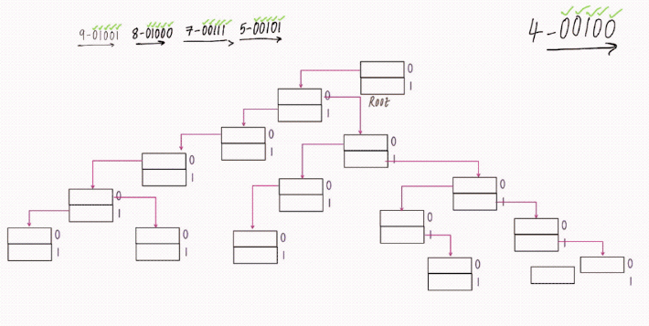
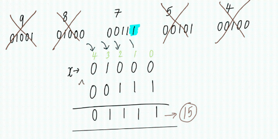
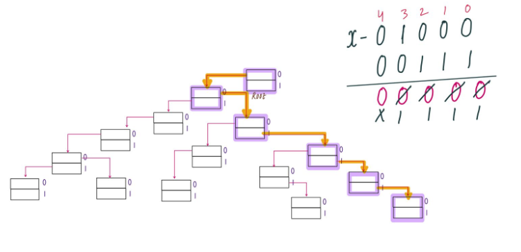

### Question
- Given an integer array nums, return the maximum result of nums[i] XOR nums[j], where 0 <= i <= j < n.

### Sample Input
    nums = [3,10,5,25,2,8]
    nums = [14,70,53,83,49,91,36,80,92,51,66,70]

### Sample Output
    28
    127

### Solution
- Our Trie will contain an array of size 2 for containing either 0 or 1 as we will store numbers in binary format
- We will initially insert all the elements of the array into Trie
  - While inserting the number’s into the trie consider the binary format (Integer – 32bit) of the arr[i] and treat it as a string and insert the value. Let’s try to understand the insertion into trie by considering only 5bit’s but while coding we have to code it for 32bit. 
  - arr[]:[9, 8, 7, 5, 4]
  - The binary format of the above array is as shown below: 
  - arr[ ]:[“01001”, “01000”, “00111”, “00101”, “00100”]
  
- Then take each number from array and treat it as x and find the maximum number from the arr where x^arr[i] is maximum.
  - In order to have maximum value, we should have set bit’s from Left – Right.
  - For every ith bit find its opposite bit if not found then take that bit.
  

### Code
    static class Node{
        Node[] links= new Node[2];  //for 0 or 1
        Node(){}
        boolean containsKey(int n){
            return links[n]!=null;
        }
        void put(int n, Node node){
            links[n]=node;
        }
        Node get(int n){
            return links[n];
        }
    }

    static class Trie{
        Node root;
        Trie(){
            root=new Node();
        }
        void insert(int n){
            Node node= root;
            for (int i = 31; i >=0 ; i--) {
                int bit = (n>>i) & 1;   //checking if ith bit is set or not
                if (!node.containsKey(bit)){
                    node.put(bit, new Node());
                }
                node = node.get(bit);
            }
        }

        int getMax(int n){
            Node node = root;
            int res=0;
            for (int i = 31; i >=0 ; i--) {
                int bit = (n >> i) & 1;
                if (node.containsKey(1-bit)){   //if we have opposite of the bit in our node
                    res = res | (1 << i);           // add it to our ans by doing OR
                    node = node.get(1 - bit);
                }else{
                    node = node.get(bit);
                }
            }
            return res;
        }
    }
    public int findMaximumXOR(int[] nums) {
        Trie t= new Trie();
        for (int num : nums){
            t.insert(num);
        }

        int maxi=0;
        for (int num:nums){
            maxi = Math.max(maxi, t.getMax(num));
        }
        return maxi;
    }

### Complexity
1. Time Complexity - O(N*32) + O(N*32)
2. Space Complexity - O(N*32)